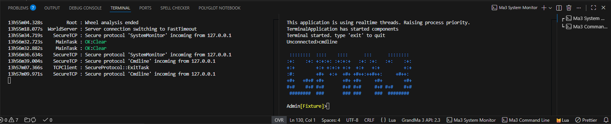

# Changelog

## 1.5.0 — January 28, 2026

### ⚠️ Important

- **Lua Diagnostic Update:** Added `---@field [string] any` to the dummy Handle definition. This allows **re-enabling the `undefined-field` diagnostic** in workspaces, providing better error detection without false positives on dynamic properties.
  
### 💻 Terminal

- **Ma3 System Monitor and Command Line in terminal:** Added two button in the bottom status bar to open Ma3 System Monitor and Command Line in a terminal.

- Those button can be hidden in the extension menu
- Special thanks to ***gabe927*** for [his post on the Ma Lighting forum](https://forum.malighting.com/forum/thread/68211-grandma3-vscode-workflow/)

### 🔤 Code Spell Checker

- **Spellcheck:** Migrated `cspell` definitions to a dedicated dictionary file for a cleaner user configuration.
- **Dictionary generation:** Added [utils/generate_cspell_dictionary.py](utils/generate_cspell_dictionary/generate_cspell_dictionary.py) to generate dictionary from resources

### ➕ Added

- **Generic Handle Property:** Added `---@field [string] any` to [resources/2.3/ma3_dummy_object.lua](resources/2.3/ma3_dummy_object.lua).
- **Reference Links:** Added "See also..." documentation for core functions: `Append`, `Insert`, `Create`, `MaxCount`, `Resize`, and `Acquire`.
- **Developer Documentation:** Added `Process_For_New_Ma3_Version.md` documenting the workflow for updating the extension for new Grand MA3 versions.
- **Update Notifications:** System to inform users about extension changes.

### 🪛 Fixed

- **Documentation:** Corrected formatting in `MessageBox` function description and `GetRTChannels` description.
- **Accuracy:** Fixed typos and inconsistencies in various JSON documentation and dummy Lua files.

### 🔄 Updated

- [CHANGELOG.md](CHANGELOG.md)
- [README.md](README.md)

## 1.4.3 — November 22, 2025

- Added short description for those functions:
  - Append
  - Insert
  - Create
  - Count
  - MaxCount
  - Resize
  - Acquire

## 1.4.2 — July 30, 2025

- Update CHANGELOG.md to change space tabs to another markdown format

## 1.4.1 — July 30, 2025

- Update CHANGELOG.md to replace tab by spaces

## 1.4.0 — July 30, 2025

### ➕ Added support of GrandMa 3 2.3 API version

#### New Object-Free API functions

- CallRealtimeLockedProtected
- HostRevision
- SelectionTable
- ChannelTable
- RemoteCallRunning
- GetVarVersion
- GetBlockInput

#### New Object API functions

- GetListItemAdditionalInfo
- SetListItemAdditionalInfo

#### Updated API functions

- **SetBlockInput function**: added "_showInfo" optional parameter
- **AddListObjectItem function**: added "_postNameText" optional parameter

#### Removed API functions

- TestPlaybackOutput function
- TestPlaybackOutputSteps function
- SampleOutput function

#### Other API improvements

- Generated list of enums

### 📁 Project Structure Updates

- Renamed folder `util/GenerateEnumsFile` to `generate_enums_file`
- Added file [publish_extension.txt](utils/vs_code/publish_extension.txt) to remember to publish extension command

### 📖 Documentation Resources

Added [ma_docs](ma_docs/2.1) folder with set of resources for each API version, including:

- **enums_list.txt** - generated with the Lua script located in the [generate_enums_file folder](utils/generate_enums_file)
- **grandMA3_lua_functions.txt** - generated with the HelpLua command
- **Lua Html** - from the official documentation located in the `C:/ProgramData/MALightingTechnology/gma3_x.x.x/shared/language/HTML` folder

### 🔧 Development

- Updated devDependencies

## 1.3.6 — July 10, 2025

- Fix SetVar value missing in autocomplete
- Fix markdown format
  
## 1.3.5 — June 16, 2025

- Fix GetTopOverlay description
- format README.md

## 1.3.4 — April 7, 2025

- Update some text format in MessageBox documentation
- Fix readme image link
- Add missing changelog for 1.3.3

## 1.3.3 — March 24, 2025

- Add new fields to Handle class and Obj function

## 1.3.2 — March 11, 2025

- Move cSpell words from workspace settings to user settings

## 1.3.1 — February 7, 2025

- Added a missing "@Optional" annotation

## 1.3.0 — February 7, 2025

- Add menu to disable extension in non-Ma3 Lua projects

## 1.2.0 — February 6, 2025

- Various spell check
- Added a missing "@Optional" annotation
- Added underscore on start of optional fields in autocomplete

## 1.1.2 — February 3, 2025

- Fix wrong text argument for MessageBox

## 1.1.1 — February 1, 2025

- Change extension logo

## 1.1.0 — January 31, 2025

- Add Enums to the dummy files

## 1.0.2 — January 30, 2025

- Add configuration to disable 'undefined-field' diagnostics in workspace

## 1.0.1 — January 30, 2025

- added missing "@Optional" annotation to few functions in the dummy files

## 1.0.0 — January 29, 2025

- Initial public release
